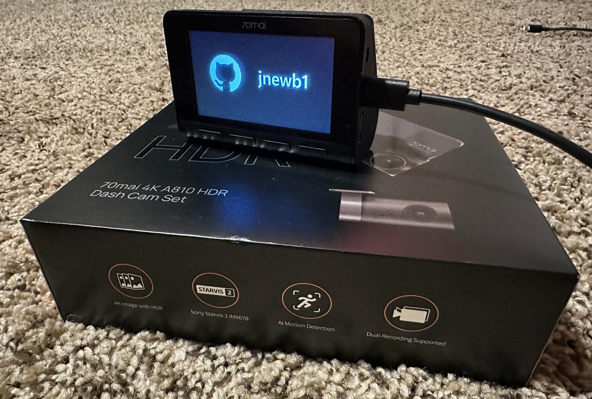

# 70mai A810 Dashcam firmware customizations


Disclaimer: This software is provided "as is," with no warranties or guarantees. The author(s) are not responsible for any damage, data loss, or legal violations resulting from its use.


|  Rear   |  Front |
| :------: | :-----: |
| [](https://70mai.store/products/dash-cam-a810) | [](https://70mai.store/products/dash-cam-a810) |


`A810_FW98529A_1.3.72ww_20231008.bin`
```
NVTPACK_FW_HDR2 found
NVTPACK_FW_HDR2_VERSION found
Found 9 partitions
Firmware file size 54,835,884 bytes
Firmware file ORIG_CRC:0xB431 CALC_CRC:0xB431
 -------------------------------------------------- PARTITIONS INFO ---------------------------------------------------
|  ID   NAME            START_OFFSET  END_OFFSET         SIZE       ORIG_CRC   CALC_CRC              TYPE              |
 ----------------------------------------------------------------------------------------------------------------------
   1    fdt              0x000000EC - 0x0000576A          22,142     0x0000     0x0000     device tree blob (dtb)
   2    fdt.restore      0x0000576C - 0x0000ADEA          22,142     0x0000     0x0000     device tree blob (dtb)
   3    uboot            0x0000ADEC - 0x00100670       1,005,700     0x0755     0x0755     uboot
   5    kernel           0x001006AC - 0x00327E40       2,258,836     0xF3F7     0xF3F7     BCL1, ZLIB 7,556,917 packed to 2,258,820 bytes
   8    rootfs           0x00327E6C - 0x007DB0E8       4,928,124     0xF1CD     0xF1CD     CKSM<--BCL1, ZLIB 12,923,392 packed to 4,928,044 bytes
   9    app              0x007DB0EC - 0x018DB12C      17,825,856     0xAE14     0xAE14     CKSM<--UBI "app"
  11    rootfs1          0x018DB12C - 0x0337B16C      27,918,400     0x79DF     0x79DF     CKSM<--UBI "rootfs"
  12    rtos             0x0337B16C - 0x0344B9E4         854,136     0x0000     0x0000     unknown part
  13    fdt.app          0x0344B9EC - 0x0344BA72             134     0x0000     0x0000     device tree blob (dtb)
 ----------------------------------------------------------------------------------------------------------------------
```


|  Partition Name  |  Type  |  Description  |
| ------ | ----- | ----- |
|  rootfs | cpio | root file system, lots of libraries |
|  app    | ubi  | contains AI models, boot logos, sounds |
|  rootfs1 | ubi | more root file system stuff |


## Installation
1. Paste the firmware in the root of the SD card, renamed to "FW98529.bin"
2. Make sure the device is completely off.
3. Insert the SD card and power on device. Will start updating.

## Modifications
- Custom logos



- root ftp on 8021

```
justin@ubuntu-24:~/a810-custom-firmware$ curl ftp://root:@192.168.0.1:8021
total 4
drwxrwxr-x    2 root     root             0 Nov 12  2024 bin
drwxr-xr-x    3 root     root             0 Nov 11 20:40 dev
drwxrwxr-x    9 root     root             0 Nov 12  2024 etc
-rwxrwxr-x    1 root     root           561 Nov 12  2024 init
drwxrwxr-x    9 root     root             0 Nov 12  2024 lib
lrwxrwxrwx    1 root     root            11 Nov 12  2024 linuxrc -> bin/busybox
drwxrwxr-x   16 root     root             0 Nov 12  2024 mnt
dr-xr-xr-x  167 root     root             0 Jan  1  1970 proc
drwxrwxr-x    2 root     root             0 Nov 12  2024 root
drwxrwxr-x    2 root     root             0 Nov 12  2024 sbin
dr-xr-xr-x   11 root     root             0 Nov 11 20:40 sys
drwxrwxrwt    2 root     root             0 Nov 11 20:40 tmp
drwxrwxr-x    6 root     root             0 Nov 12  2024 usr
drwxrwxr-x    7 root     root             0 Nov 12  2024 var
```